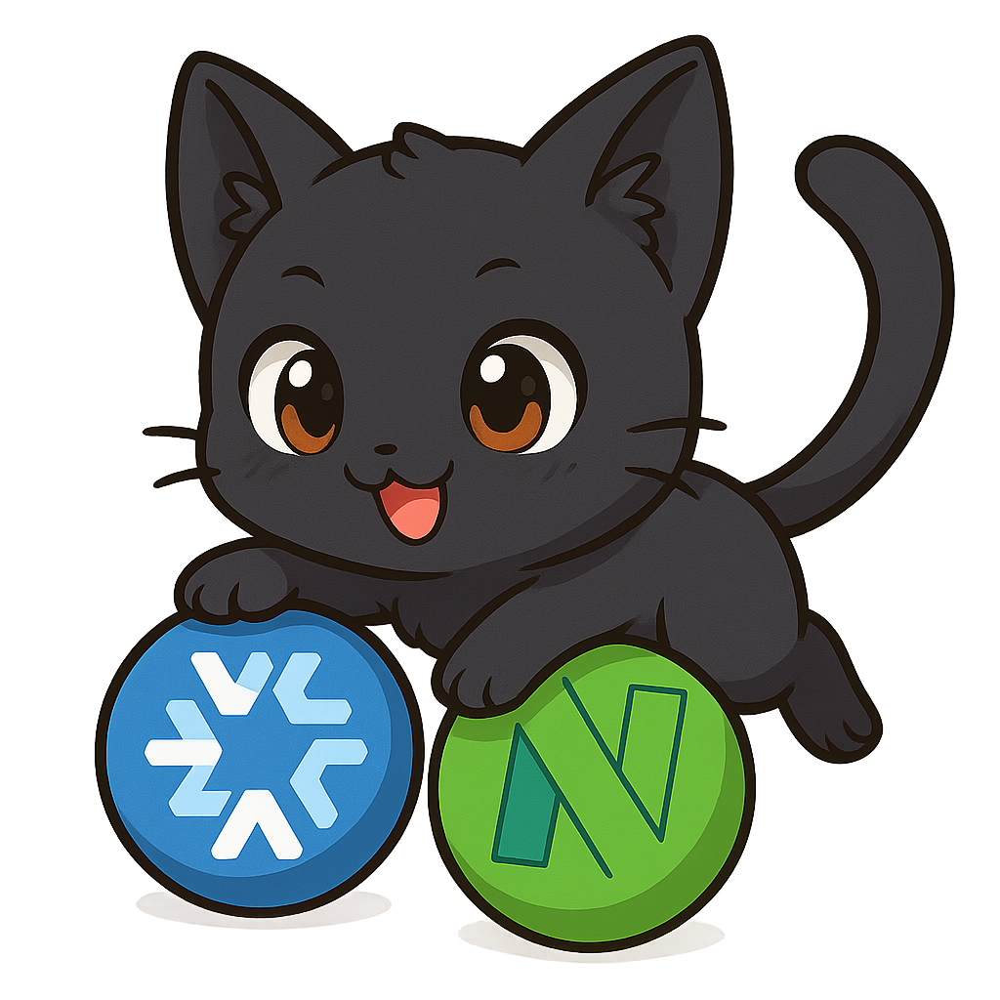
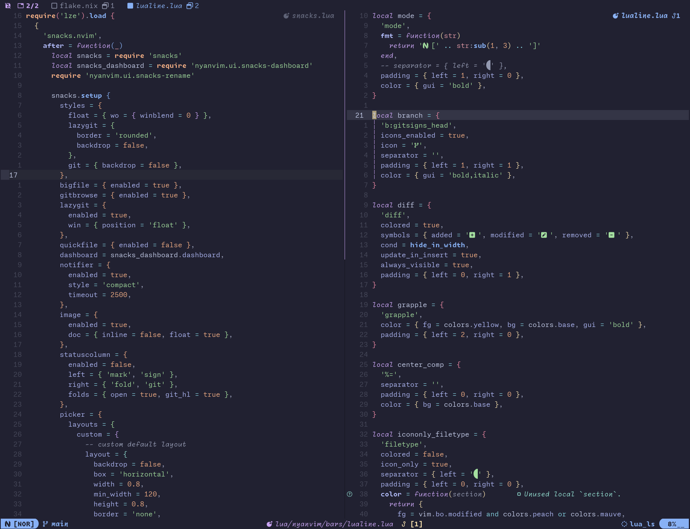
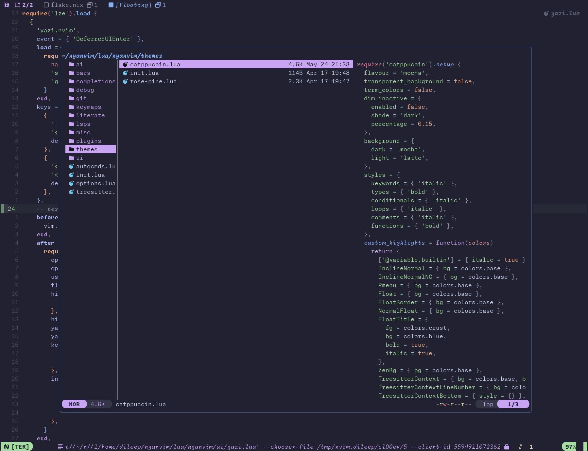

<!-- markdownlint-disable -->
<h1 align="center">
    <a name="top" title="nvim-nix">
        Nyanvim
    </a>
    <br />
    
</h1>
<div align="center">
  <a href="https://github.com/dileep-kishore/nyanvim">
  </a>
  <p>
    <strong>
      A <a href="https://neovim.io/">Neovim</a> configuration as a <a href="https://nixos.org/">Nix</a> flake ❄️ configured using <a href="https://github.com/BirdeeHub/nixCats-nvim">nixCats</a></br>
    </strong>
  </p>


</div>
<!-- markdownlint-restore -->

<!-- markdownlint-disable MD013 -->

This flake uses [nixCats-nvim](https://github.com/BirdeeHub/nixCats-nvim) to configure neovim.
The advantage of using this over a [configuration](https://github.com/dileep-kishore/neovim) defined using [nixvim](https://github.com/nix-community/nixvim)
is that only the plugin installation is handled through [Nix](https://nixos.org/manual/nix/stable/language/index.html) and the rest of the configuration is done using Lua.

## Running the flake

To run this nix flake simply run the following command

```sh
nix run github:dileep-kishore/nyanvim
```

> [!NOTE]
> You will need to install the `nix` package manager before you can run the previous command

Or you can use [home-manager](https://github.com/nix-community/home-manager) to add this flake to your setup like so:

```nix
{
    inputs.neovim = {
      url = "github:dileep-kishore/nyanvim";
      inputs.nixpkgs.follows = "nixpkgs";
    };
}
```

And then install it by adding `inputs.neovim.packages.${system}.default` to your packages

## Gallery

|   _Dashboard_ (Snacks dashboard)   |
| :--------------------------------: |
|  |

| _Editor_ (tabby.nvim + incline.nvim + lualine) |
| :--------------------------------------------: |
|                  |

|     _Autocompletions_ (blink.cmp + copilot)      |
| :----------------------------------------------: |
|  |

|     _Git_ (Lazygit)      |
| :----------------------: |
|  |

|     _File pickers_ (Snacks)      |
| :------------------------------: |
|  |

| _File navigation_ (yazi.nvim) |
| :---------------------------: |
|     |

## Features

- Works out of the box without needing to install any external dependencies.
  - This includes lsp servers, linters, formatters or other packages.
- A lot of the default options and autocmds that you would find on a distribution like [Lazyvim](https://www.lazyvim.org) are configured out of the box
- [Treesitter](https://github.com/nvim-treesitter/nvim-treesitter) syntax highlighting is enabled and [catppuccin](https://github.com/catppuccin/nvim) theme is set as the default
- Uses custom statusline configured using [lualine.nvim](https://github.com/nvim-lualine/lualine.nvim)
- Custom tabline configured using [tabby.nvim](https://github.com/nanozuki/tabby.nvim) and [incline.nvim](https://github.com/b0o/incline.nvim)
- Git integration through [neogit](https://github.com/NeogitOrg/neogit) and [snacks.lazygit](https://github.com/folke/snacks.nvim/blob/main/docs/lazygit.md)
- Lsp servers, linters and formatters for configured for Python, Nix, Lua, Javascript, Typescript, Julia, Bash, Rust, Go and many more
- Debugging is supported through the [Debugging adapter protocol (DAP) plugin](https://github.com/mfussenegger/nvim-dap).
  - This is currently only setup to work with Python
- Completions are enabled through [blink.cmp](https://github.com/Saghen/blink.cmp)
- Snippets are set up using [mini.snippets](https://github.com/echasnovski/mini.snippets) and [friendly-snippets](https://github.com/rafamadriz/friendly-snippets)
- [Snacks pickers](https://github.com/folke/snacks.nvim/blob/main/docs/picker.md) for fuzzy file finding and searching
- Better file navigation using [yazi.nvim](https://github.com/mikavilpas/yazi.nvim) and [Grapple.nvim](https://github.com/cbochs/grapple.nvim)
- AI capabilities are enabled through [Avante.nvim](https://github.com/yetone/avante.nvim), [copilot.lua](https://github.com/zbirenbaum/copilot.lua) and [blink-copilot](https://github.com/fang2hou/blink-copilot)
- Indent lines are enabled using [mini.indentscope](https://github.com/echasnovski/mini.indentscope)
- The dashboard is set up using [Snacks dashboard](https://github.com/folke/snacks.nvim/blob/main/docs/dashboard.md)
- Supports literate programming through [iron.nvim](https://github.com/Vigemus/iron.nvim) and [neopyter](https://github.com/SUSTech-data/neopyter)
- Note-taking capabilities through [obsidian.nvim](https://github.com/obsidian-nvim/obsidian.nvim/) and [render-markdown.nvim](https://github.com/MeanderingProgrammer/render-markdown.nvim)
- And many other features! Check out `categories.nix` and the `lua/nyanvim/` folder

## Manual Installation

The julia language server is not currently supported by nixpkgs, so you will need to install it manually.

```sh
julia --project=~/.julia/environments/nvim-lspconfig -e 'using Pkg; Pkg.add("LanguageServer")'
```
